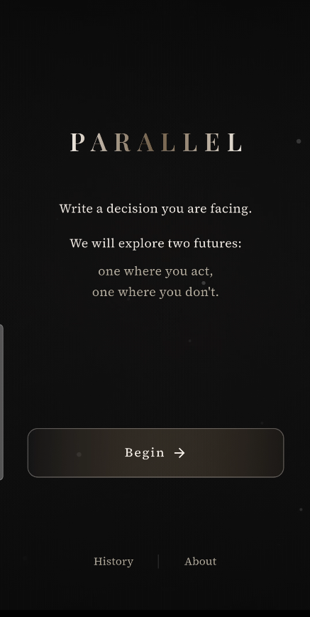
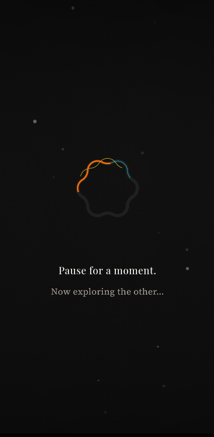
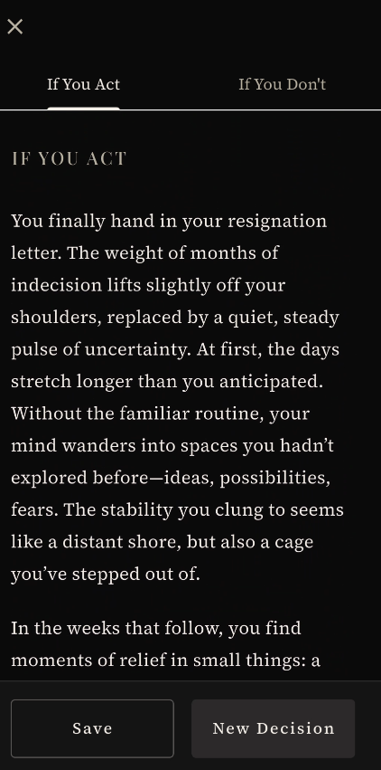
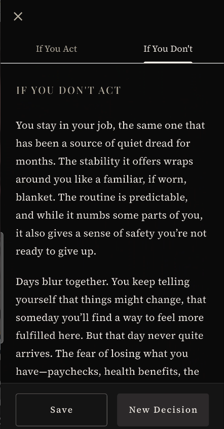
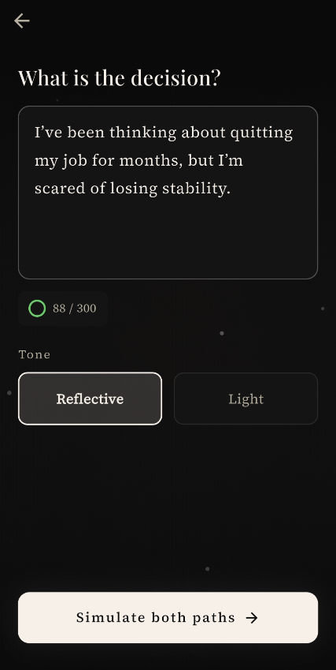

# Parallel

> **Two paths. One choice. Explore two believable futures.**

Parallel is a reflective decision-exploration app that helps you visualize the consequences of your choices through AI-generated narrative fiction. Simply describe a decision you're facing, and Parallel will craft two intimate stories: one where you act, and one where you don't.

<p align="center">
  
</p>

---

## ✨ Features

- **Dual Narrative Generation** — AI-powered stories exploring both paths of your decision
- **Tone Selection** — Choose between *Reflective* (serious, introspective) or *Light* (depth without gravity)
- **Multi-Language Support** — Write in any language (English, French, Arabic, Tunisian dialect) and get responses in the same language
- **Memory Continuity** — The app subtly recognizes recurring themes in your decisions
- **Beautiful Dark Aesthetic** — Calm, literary design with warm typography
- **Local History** — All your past explorations saved privately on your device

---

## 📱 Screenshots

<p align="center">
  
  
  
</p>

<p align="center">
  
  
</p>

---

## 🚀 Getting Started

### Prerequisites

- Flutter SDK 3.10.3 or higher
- OpenAI API key

### Installation

1. **Clone the repository**
   ```bash
   git clone https://github.com/Maher-Tec/Parallel.git
   cd Parallel
   ```

2. **Install dependencies**
   ```bash
   flutter pub get
   ```

3. **Configure environment**
   
   Create a `.env` file in the root directory:
   ```env
   OPENAI_API_KEY=your_openai_api_key_here
   ```

4. **Run the app**
   ```bash
   flutter run
   ```

---

## 🏗️ Project Structure

```
lib/
├── main.dart                 # App entry point
├── theme/
│   └── app_theme.dart        # Dark literary theme
├── screens/
│   ├── splash_screen.dart    # Animated splash
│   ├── launch_screen.dart    # Welcome screen
│   ├── input_screen.dart     # Decision input
│   ├── pause_screen.dart     # Loading state
│   ├── result_screen.dart    # Dual narratives
│   ├── history_screen.dart   # Past explorations
│   └── about_screen.dart     # App info
├── services/
│   ├── ai_service.dart       # OpenAI integration
│   ├── fallback_service.dart # DeepSeek fallback
│   ├── memory_service.dart   # Continuity detection
│   └── input_validator.dart  # Input filtering
├── models/
│   └── decision_entry.dart   # Data model
├── storage/
│   └── local_store.dart      # SharedPreferences
└── widgets/
    └── ambient_background.dart # Animated background
```

---

## 🎨 Design Philosophy

- **Literary Aesthetic** — Inspired by opening a book, not an app
- **Emotional Safety** — No advice, no judgment, just exploration
- **Grounded Realism** — Stories stay true to your situation
- **Calm Contrast** — Dark theme with warm off-white typography

---

## 📄 License

This project is private and proprietary.

---

## 👨‍💻 Author

**Maher Ahmed**  
[GitHub](https://github.com/Maher-Tec)

---

<p align="center">
  <i>"The future is not a single line. It branches."</i>
</p>
